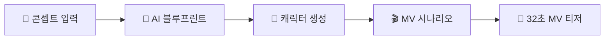
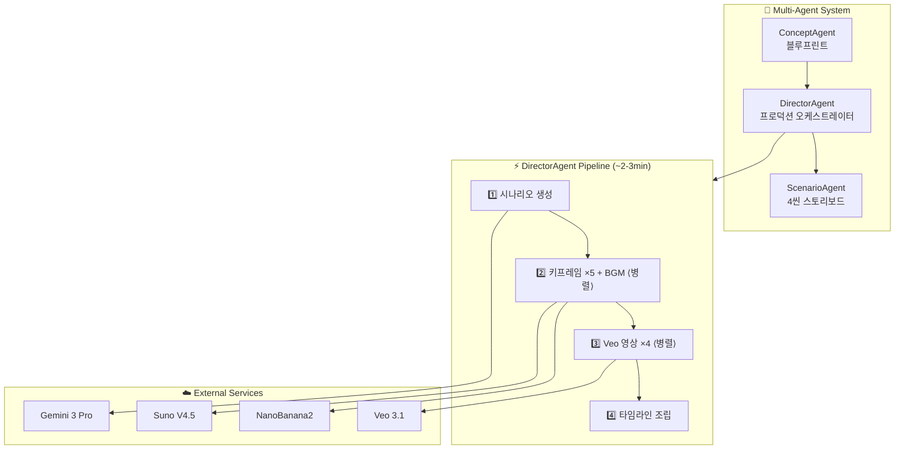

<div align="center">

<br/>

# ✦ D E B U T ✦

### AI Virtual Idol Production Studio

<br/>

[](https://ai.google.dev)
[](https://ai.google.dev)
[](https://ai.google.dev)
[](https://suno.com)

[](https://nextjs.org)
[](https://fastapi.tiangolo.com)
[](https://typescriptlang.org)
[](https://tailwindcss.com)
[](https://python.org)

<br/>

**유닛 이름과 콘셉트만 입력하면, AI 멀티에이전트가**
**멤버 기획 → 캐릭터 비주얼 → MV 시나리오 → BGM → 32초 MV 티저까지**
**전 과정을 자동으로 프로듀싱합니다.**

*Your Imagination, Their Debut.*

<br/>

---

</div>

<br/>

## What is Debut?

**Debut**는 누구나 K-Pop 기획사의 총괄 프로듀서가 되어, 클릭 몇 번만으로 자신만의 버추얼 아이돌을 기획하고 데뷔시키는 **E2E 아이돌 프로덕션 스튜디오**입니다.

AI가 단순한 '생성기'를 넘어, 기획·캐스팅·작곡·영상 연출까지 담당하는 **가상의 디렉터 팀(멀티 에이전트)**으로 동작합니다.

<br/>

## Pipeline



| Step | 기능 | AI |
|:----:|------|:--:|
| **1** | 유닛 설정 — 이름 + 그룹타입 + 콘셉트 + 아트스타일 | `Gemini 3 Pro` |
| **2** | 비주얼 생성 — 멤버 이미지 생성/편집 | `NanoBanana2` |
| **3** | 인격 확인 — 세계관 + 프로필 인라인 편집 | — |
| **4** | 타이틀 사운드 — BGM 생성 | `Suno V4.5` |
| **5** | MV 티저 — 4씬 영상 자동 생성 | `Veo 3.1` |

<br/>

## Architecture



<br/>

## Keyframe Chaining

4개 씬의 이음새 없는 전환을 위해 **5개 키프레임**을 생성합니다.

```
키프레임:  [F0] ───→ [F1] ───→ [F2] ───→ [F3] ───→ [F4]
            │          │          │          │          │
씬:        └── 씬 1 ──┘└── 씬 2 ──┘└── 씬 3 ──┘└── 씬 4 ──┘
            first→last   first→last   first→last   first→last
```

> 씬 N의 마지막 프레임 = 씬 N+1의 첫 프레임 → Veo 3.1 `first-last-frame-to-video`

<br/>

## Tech Stack

| Layer | Technology |
|:-----:|-----------|
| **Frontend** | Next.js 16 · React 19 · TypeScript 5.9 · Tailwind CSS 4 |
| **Backend** | FastAPI (Python) · Pydantic v2 |
| **LLM** | Gemini 3 Pro (`gemini-3-pro-preview`) via AI Gateway |
| **Image** | NanoBanana2 (`gemini-3-pro-image-preview`) |
| **Video** | Veo 3.1 (`first-last-frame-to-video`) via fal.ai |
| **Music** | Suno V4.5 via sunoapi.org |

<br/>

## Quick Start

### Backend

```bash
cd backend
pip install -r requirements.txt
cp .env.example .env  # API 키 설정
uvicorn src.main:app --reload --port 8000
```

### Frontend

```bash
cd frontend
npm install
npm run dev  # http://localhost:3000
```

<br/>

## Features

- **걸그룹 / 보이그룹** — 각 8종 실제 K-pop 컨셉
- **실사 / 버추얼** — 아트 스타일 선택
- **키프레임 체이닝** — 5개 키프레임으로 씬 간 이음새 없는 전환
- **@N 레퍼런스** — 다른 멤버 이미지를 참조한 편집
- **인라인 편집** — 세계관, 멤버 프로필 실시간 수정
- **Suno 콜백+폴링** — 하이브리드 BGM 생성
- **실시간 진행 UI** — 3초 폴링으로 파이프라인 단계별 표시

<br/>

## Concepts

<table>
<tr>
<th align="center">👩 Girl Group (8)</th>
<th align="center">👨 Boy Group (8)</th>
</tr>
<tr>
<td>

| 컨셉 | 대표 그룹 |
|------|-----------|
| 걸크러쉬 | BLACKPINK, LE SSERAFIM |
| 청순 | Apink, 여자친구 |
| 큐트 | TWICE, ILLIT |
| 틴크러쉬 | IVE, STAYC |
| 엘레강스 | Red Velvet |
| 다크 | (G)I-DLE, Dreamcatcher |
| 레트로 | NewJeans, KISS OF LIFE |
| 퓨처리스틱 | aespa, MAVE: |

</td>
<td>

| 컨셉 | 대표 그룹 |
|------|-----------|
| 파워풀 | Stray Kids, ATEEZ |
| 청량 | 세븐틴, RIIZE, TWS |
| 다크판타지 | ENHYPEN, VIXX |
| 꽃미남 | TXT, ASTRO |
| 힙합/스트릿 | BTS, Block B |
| 몽환/드리미 | TXT, PLAVE |
| 레트로 | SHINee, SUPER JUNIOR |
| 퓨처리스틱 | NCT, EXO |

</td>
</tr>
</table>

<br/>

## MV Teaser Spec

| Spec | Value |
|:----:|:-----:|
| Duration | `32s` (8s × 4 scenes) |
| Aspect Ratio | `9:16` (mobile) |
| Resolution | `720p` |
| Scene Arc | OPENING → BUILD → CLIMAX → REVEAL |
| Keyframes | `5` (seamless transitions) |
| Camera | push-in · orbit · tracking · low-angle |

<br/>

## Project Structure

```
debut/
├── backend/
│   └── src/
│       ├── agents/          # ConceptAgent, ScenarioAgent, DirectorAgent
│       ├── services/        # llm_client, gateway, veo, suno, asset_store
│       ├── models/          # Pydantic 데이터 모델
│       └── routers/         # FastAPI 엔드포인트
├── frontend/
│   ├── app/create/step1~5/  # 5단계 위저드
│   ├── app/debut/           # 쇼케이스 페이지
│   ├── contexts/            # SessionContext
│   ├── lib/                 # API client, types, constants
│   └── components/          # WizardProgress, MemberPersonaEditor
├── design/                  # 디자인 시스템, 브랜드 아이덴티티
└── docs/
    ├── ARCHITECTURE.md      # 시스템 설계서
    └── PROJECT_PLAN.md      # 기획서
```

<br/>

---

<div align="center">

Built for **Gemini 3 Seoul Hackathon 2026** — Entertainment Track

*프로듀싱의 마법, 3분 만에 열리는 무대*

</div>
