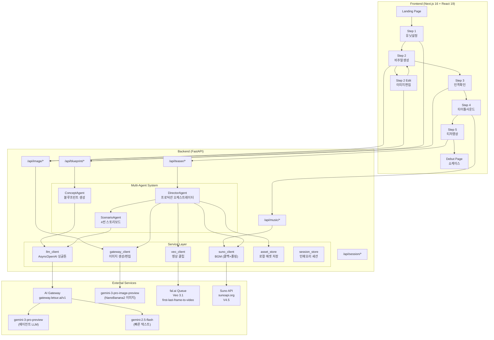
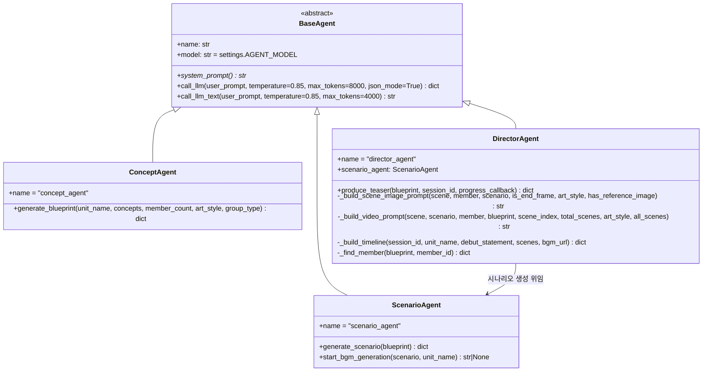
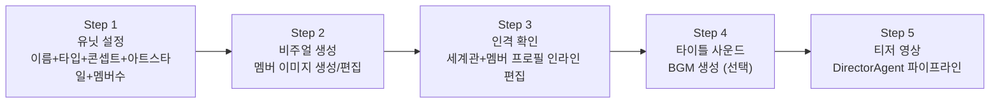

# Debut — 시스템 설계서

> 멀티에이전트 MV 티저 프로덕션 파이프라인 아키텍처

---

## 1. 전체 아키텍처



---

## 2. 에이전트 시스템

### 2.1 에이전트 계층 구조



### 2.2 BaseAgent

```python
class BaseAgent(ABC):
    name: str
    model: str = settings.AGENT_MODEL  # "gemini-3-pro-preview"

    @abstractmethod
    def system_prompt(self) -> str: ...

    async def call_llm(
        self, user_prompt: str, *,
        temperature: float = 0.85,
        max_tokens: int = 8000,
        json_mode: bool = True,
    ) -> dict

    async def call_llm_text(
        self, user_prompt: str, *,
        temperature: float = 0.85,
        max_tokens: int = 4000,
    ) -> str
```

- `llm_client.py`의 싱글톤 `AsyncOpenAI` 클라이언트 사용
- OpenAI SDK 호환 AI Gateway (`gateway.letsur.ai/v1`)
- JSON 모드 기본 활성화 (구조화된 응답)

### 2.3 ConceptAgent

**입력**: 유닛 이름, 콘셉트 키워드, 멤버 수, **아트 스타일**, **그룹 타입**
**출력**: 블루프린트 JSON

```python
async def generate_blueprint(
    unit_name: str,
    concepts: list[str],
    member_count: int,
    art_style: str = "realistic",   # realistic | virtual
    group_type: str = "girl",       # girl | boy
) -> dict
```

**걸그룹 컨셉** (8종): 걸크러쉬, 청순, 큐트, 틴크러쉬, 엘레강스, 다크, 레트로, 퓨처리스틱
**보이그룹 컨셉** (8종): 파워풀, 청량, 다크판타지, 꽃미남, 힙합/스트릿, 몽환/드리미, 레트로, 퓨처리스틱

**아트 스타일**:
- `realistic` — 실사 포토리얼리스틱 (실제 K-pop 아이돌 스타일)
- `virtual` — 애니메이션/일러스트 (PLAVE, K/DA 스타일)

**출력 JSON**:
```json
{
  "members": [{
    "member_id": "m1",
    "stage_name": "AURORA",
    "real_name": "김하늘",
    "position": "Main Vocal / Center",
    "personality": "한국어 성격 설명",
    "speech_style": "팬과 대화 스타일",
    "fan_nickname": "팬 별명",
    "visual_description": "극도로 상세한 외모 묘사 (이미지 생성용)",
    "age": 19,
    "mbti": "INFJ",
    "color_palette": ["#8B5CF6", "#E879F9"],
    "motion_style": "elegant"
  }],
  "group_worldview": "세계관 (한국어)",
  "debut_concept_description": "데뷔 콘셉트 (한국어)",
  "fandom_name": "팬덤명 (영문)",
  "debut_statement": "데뷔 멘트 (한국어)"
}
```

### 2.4 ScenarioAgent

**입력**: 블루프린트 전체
**출력**: 4씬 시나리오 JSON + BGM 방향

```python
async def generate_scenario(blueprint: dict) -> dict
async def start_bgm_generation(scenario: dict, unit_name: str = "") -> str | None
```

```json
{
  "title": "MV 티저 제목",
  "mood": "dark, mysterious",
  "color_grading": "cool blue with neon purple accents",
  "scenes": [{
    "scene_number": 1,
    "duration": 8,
    "description": "한국어 씬 설명",
    "visual_concept": "Veo 3.1용 초상세 영문 묘사",
    "camera_movement": "slow push-in",
    "lighting": "neon rim light, volumetric fog",
    "member_focus": "m1",
    "emotion": "mysterious",
    "transition_to_next": "fade"
  }],
  "music_direction": {
    "genre": "dark pop",
    "tempo": "medium",
    "mood_keywords": ["mysterious", "powerful"],
    "lyrics_hint": "가사 힌트",
    "instrumental_style": "synth-heavy, orchestral"
  }
}
```

씬 아크: **인트로 미스터리 → 빌드업 → 클라이맥스 → 리빌**

### 2.5 DirectorAgent (492줄)

**입력**: 블루프린트 + 세션 ID + progress_callback
**출력**: 완성된 MV 티저 에셋 전체

```python
async def produce_teaser(
    blueprint: dict,
    session_id: str,
    progress_callback=None,
) -> dict
```

**내러티브 아크**:
```python
_SCENE_ARC = {
    0: {"role": "OPENING", "action": "Slow reveal, building mystery"},
    1: {"role": "BUILD",   "action": "Rising energy, confident walk"},
    2: {"role": "CLIMAX",  "action": "Peak energy, sharp dance move"},
    3: {"role": "REVEAL",  "action": "Grand finale, hero shot"},
}
```

**프로덕션 파이프라인**:

```mermaid
graph TD
    A["Step 1: ScenarioAgent<br/>4씬 시나리오 JSON<br/>~5-8초"]

    subgraph Step2["Step 2: asyncio.gather() — 병렬"]
        B1["키프레임 이미지 ×5<br/>(NanoBanana2)"]
        B2["BGM 생성<br/>(Suno V4.5 콜백+폴링)"]
    end

    subgraph Step3["Step 3: asyncio.gather() — 병렬"]
        C1["Veo 클립 1<br/>frame[0]→frame[1]"]
        C2["Veo 클립 2<br/>frame[1]→frame[2]"]
        C3["Veo 클립 3<br/>frame[2]→frame[3]"]
        C4["Veo 클립 4<br/>frame[3]→frame[4]"]
    end

    D["Step 4: 에셋 저장 + 타임라인 조립<br/>Remotion 호환 JSON"]

    A --> Step2
    Step2 --> Step3
    Step3 --> D

    style Step2 fill:#1a1a2e,stroke:#7B2FF7
    style Step3 fill:#1a1a2e,stroke:#FF1493
```



**키프레임 체이닝** (핵심 변경점):
- 4씬에 대해 **5개 키프레임** 생성 (첫 프레임 + 끝 프레임)
- 씬 N의 끝 프레임 = 씬 N+1의 첫 프레임 → **이음새 없는 전환**
- Veo 3.1 `first-last-frame-to-video` 엔드포인트 활용

```
키프레임:  [F0] ──→ [F1] ──→ [F2] ──→ [F3] ──→ [F4]
            │         │         │         │         │
씬:        ╰── 씬1 ──╯╰── 씬2 ──╯╰── 씬3 ──╯╰── 씬4 ──╯
            first→last  first→last  first→last  first→last
```

---

## 3. Director 파이프라인 상세

### 3.1 실행 타이밍 (예상)

```mermaid
gantt
    title Director Pipeline 실행 타이밍
    dateFormat ss
    axisFormat %S초

    section Step 1
    ScenarioAgent : s1, 00, 8s

    section Step 2 (병렬)
    키프레임 이미지 ×5 : i1, 08, 15s
    BGM (Suno 콜백/폴링) : b1, 08, 40s

    section Step 3 (병렬)
    Veo Clip 1 (F0→F1) : v1, 48, 60s
    Veo Clip 2 (F1→F2) : v2, 48, 60s
    Veo Clip 3 (F2→F3) : v3, 48, 60s
    Veo Clip 4 (F3→F4) : v4, 48, 60s

    section Step 4
    에셋 저장 + 타임라인 : t1, 108, 2s
```



총 예상: **약 2~3분** (전부 병렬 처리)

### 3.2 이미지 프롬프트 빌드

```python
def _build_scene_image_prompt(
    scene, member, scenario,
    is_end_frame=False,        # 끝 프레임 여부
    art_style="realistic",     # realistic | virtual
    has_reference_image=False,  # 레퍼런스 이미지 여부
) -> str
```

조합: 멤버 visual_description + 씬 visual_concept + lighting + camera + color_palette + color_grading + art_style 지시

### 3.3 비디오 프롬프트 빌드

```python
def _build_video_prompt(
    scene, scenario, member, blueprint,
    scene_index=0,          # 씬 인덱스 (내러티브 아크 참조)
    total_scenes=4,
    art_style="realistic",
    all_scenes=None,        # 전체 씬 컨텍스트
) -> str
```

내러티브 아크(`_SCENE_ARC`) + 씬 visual_concept + camera + lighting + mood + color_grading

### 3.4 진행 콜백

| 콜백 | 의미 |
|------|------|
| `scenario` | 시나리오 생성 시작 |
| `scenario_done` | 시나리오 완성 (제목 + 씬 수) |
| `assets` | BGM + 키프레임 이미지 병렬 생성 시작 |
| `image_done` × 5 | 키프레임 이미지 완성 |
| `bgm_done` | BGM 완성 |
| `videos` | Veo 3.1 영상 생성 시작 |
| `video_done` × 4 | 씬별 영상 완성 |
| `timeline` | 타임라인 조립 + 에셋 저장 |
| `done` | 전체 완료 |

Frontend Step 5에서 3초 간격으로 `/api/teaser/progress/{session_id}` 폴링.

---

## 4. 타임라인 스키마 (Remotion 호환)

```json
{
  "project": {
    "id": "session-uuid",
    "name": "NOVA MV Teaser",
    "duration": 32,
    "aspectRatio": "9:16",
    "fps": 30
  },
  "clips": [
    {
      "id": "clip-video-1",
      "trackId": "video-main",
      "type": "video",
      "startTime": 0,
      "duration": 8,
      "data": { "src": "https://...", "type": "video" },
      "effects": { "transition": "fade" }
    },
    {
      "id": "clip-bgm",
      "trackId": "audio-bgm",
      "type": "audio",
      "startTime": 0,
      "duration": 32,
      "data": { "src": "https://...", "type": "mp3" }
    }
  ],
  "opening": { "enabled": true, "duration": 2, "title": "NOVA" },
  "closing": { "enabled": true, "duration": 2, "title": "데뷔 멘트..." }
}
```

---

## 5. 데이터 모델

### 5.1 Member

```python
class Member(BaseModel):
    member_id: str
    stage_name: str
    real_name: str = ""
    position: str = ""
    personality: str = ""
    speech_style: str = ""
    fan_nickname: str = ""
    visual_description: str = ""
    age: int = 0
    mbti: str = ""
    image_url: str | None = None
    color_palette: list[str] = []
    motion_style: str = ""
```

### 5.2 Blueprint

```python
class Blueprint(BaseModel):
    unit_name: str
    concepts: list[str] = []
    art_style: str = "realistic"   # realistic | virtual
    group_type: str = "girl"       # girl | boy
    members: list[Member] = []
    group_worldview: str = ""
    debut_concept_description: str = ""
    fandom_name: str = ""
    debut_statement: str = ""
```

### 5.3 BlueprintRequest

```python
class BlueprintRequest(BaseModel):
    session_id: str
    unit_name: str
    concepts: list[str]            # 1~4개
    member_count: int              # 1~3명
    art_style: str = "realistic"
    group_type: str = "girl"
    language: str = "ko"
```

### 5.4 Session

```python
class Session(BaseModel):
    session_id: str
    status: str = "created"
    blueprint: Blueprint | None = None
    music_url: str | None = None
    teaser_url: str | None = None
    teaser_operation_id: str | None = None
    scenario: dict | None = None
    teaser_scenes: list[dict] = []
    bgm_url: str | None = None
    timeline: dict | None = None
    teaser_progress: str = ""
```

---

## 6. API 엔드포인트

### 6.1 세션

| Method | Path | 설명 |
|--------|------|------|
| POST | `/api/session/create` | 세션 생성 → `{ session_id, created_at, status }` |
| GET | `/api/session/{id}` | 세션 전체 데이터 조회 |

### 6.2 블루프린트

| Method | Path | 설명 |
|--------|------|------|
| POST | `/api/blueprint/generate` | ConceptAgent 블루프린트 생성 |
| PATCH | `/api/blueprint/{session_id}` | 블루프린트 필드 수정 (세계관, 팬덤명 등) |
| PATCH | `/api/blueprint/{session_id}/members/{member_id}` | 개별 멤버 필드 수정 |

### 6.3 이미지

| Method | Path | 설명 |
|--------|------|------|
| POST | `/api/image/generate` | NanoBanana 멤버 이미지 생성 |
| POST | `/api/image/edit` | 레퍼런스 이미지 기반 편집 |

### 6.4 음악

| Method | Path | 설명 |
|--------|------|------|
| POST | `/api/music/generate` | Suno BGM 생성 (콜백+폴링 하이브리드) |
| POST | `/api/music/callback` | Suno 콜백 웹훅 수신 |

### 6.5 티저

| Method | Path | 설명 |
|--------|------|------|
| POST | `/api/teaser/generate` | DirectorAgent 파이프라인 시작 (백그라운드) |
| GET | `/api/teaser/status/{op_id}` | 티저 상태 (레거시 호환) |
| GET | `/api/teaser/progress/{session_id}` | 상세 진행 상태 + 씬별 에셋 |

---

## 7. 서비스 레이어

### 7.1 llm_client.py (싱글톤)

```python
def get_llm_client() -> AsyncOpenAI:
    """AI Gateway 싱글톤 클라이언트 (모든 에이전트 공유)"""
```

### 7.2 gateway_client.py (이미지 생성/편집)

```python
async def generate_image(
    visual_description, unit_name, concept,
    reference_image_b64=None,   # 레퍼런스 이미지 (캐릭터 일관성)
) -> str | None

async def edit_image(
    reference_image_b64, edit_instructions,
) -> str | None
```

- 레퍼런스 이미지 제공 시 텍스트+이미지 멀티모달 요청
- 캐릭터 동일성 유지하면서 새 씬 이미지 생성

### 7.3 veo_client.py (영상 생성)

```python
async def generate_single_clip(
    prompt, session_id, scene_number,
    first_frame_url=None,
    last_frame_url=None,
) -> str | None
```

- fal.ai 비동기 큐 (submit → poll → fetch)
- 최대 10분 대기, 5초 간격 폴링
- `first-last-frame-to-video` 엔드포인트

### 7.4 suno_client.py (BGM 생성)

```python
async def generate_bgm(
    title, genre, mood_keywords,
    lyrics_hint="", instrumental_style="",
) -> str | None

def handle_suno_callback(body: dict) -> None
```

- **콜백 + 폴링 하이브리드**: 콜백 URL 설정 시 콜백 우선, 미수신 시 폴링 폴백
- `_pending_callbacks` 딕셔너리로 비동기 이벤트 관리
- 프롬프트에 32초 뮤지컬 아크 프론트로드 (0-8s hook → 8-16s build → 16-24s climax → 24-32s outro)

### 7.5 asset_store.py (에셋 저장)

```
assets/{group_name}/
  group_info.json, scenario.json, timeline.json
  members/{member_id}_{stage_name}/profile.json, concept.png
  scenes/scene_{N}/first_frame.png, clip.mp4, scene_info.json
  bgm/bgm.mp3
  final/teaser.mp4
```

### 7.6 session_store.py (인메모리)

```python
def create_session() -> Session
def get_session(session_id) -> Session | None
def update_session(session_id, **kwargs) -> Session | None
```

---

## 8. 외부 서비스 연동

### 8.1 AI Gateway (Letsur)

```
Base URL: https://gateway.letsur.ai/v1
SDK: OpenAI Python SDK (AsyncOpenAI) — 싱글톤

에이전트 LLM → gemini-3-pro-preview
빠른 텍스트 → gemini-2.5-flash
이미지 생성 → gemini-3-pro-image-preview (NanoBanana2)
```

> NanoBanana2는 AI Gateway를 통해 호출하는 `gemini-3-pro-image-preview` 모델의 이미지 생성 기능이다.

### 8.2 fal.ai (Veo 3.1)

```
모델: fal-ai/veo3.1/fast/first-last-frame-to-video
인증: Key {FAL_API_KEY}

비동기 큐:
  1. POST /queue/submit → request_id
  2. GET /requests/{id}/status (5초 폴링, 최대 10분)
  3. GET /requests/{id} → video.url

파라미터:
  prompt, first_frame_url, last_frame_url
  duration: "8s", aspect_ratio: "9:16", resolution: "720p"
  generate_audio: false
```

### 8.3 Suno API (sunoapi.org)

```
Base URL: https://api.sunoapi.org/api/v1
인증: Bearer {SUNO_API_KEY}
모델: V4_5

생성: POST /generate → taskId
콜백: POST /api/music/callback (callbackType: complete|first|text|error)
폴링: GET /generate/record-info?taskId={id} (폴백)

파라미터:
  prompt, style, title
  customMode: true, instrumental: true/false
  callBackUrl: 콜백 URL (있으면 콜백 우선)
```

---

## 9. Frontend 상세

### 9.1 상태 관리 (SessionContext)

```typescript
interface SessionState {
  sessionId: string | null
  unitName: string
  groupType: "girl" | "boy"          // NEW
  concepts: string[]
  memberCount: number
  artStyle: "realistic" | "virtual"  // NEW
  blueprint: Blueprint | null
  memberImages: Record<string, string>
  musicUrl: string | null
  teaserUrl: string | null
  teaserOperationId: string | null
  isLoading: boolean
  loadingMessage: string
}
```

### 9.2 5단계 위저드



### 9.3 Step 1 — 유닛 설정 (218줄)

입력 필드:
- 유닛 이름 (최대 30자)
- 그룹 타입: `girl` / `boy` → 컨셉 목록 분기
- 콘셉트 선택 (최대 3개, 그룹 타입별 8종)
- 아트 스타일: `realistic` (실사) / `virtual` (버추얼)
- 멤버 수 (1~3명)

### 9.4 Step 2 — 비주얼 생성 (183줄) + Edit (488줄)

**생성**: 전체/개별 멤버 이미지 생성, 재생성
**편집** (별도 페이지):
- `@1`, `@2` 레퍼런스 구문으로 다른 멤버 이미지 참조
- 자동완성 드롭다운
- 편집 히스토리 + 언두
- 편집 제안 템플릿

### 9.5 Step 3 — 인격 확인 (226줄)

`MemberPersonaEditor` 컴포넌트 (232줄):
- 접이식 아코디언으로 멤버별 편집
- 기본 정보: stage_name, real_name, age, mbti
- 아이덴티티: position, fan_nickname, personality, speech_style, motion_style
- 비주얼: visual_description (멀티라인)
- 500ms 디바운스 API 동기화

블루프린트 편집:
- 세계관, 팬덤명, 데뷔 콘셉트, 데뷔 멘트 인라인 편집

### 9.6 Step 4 — 타이틀 사운드 (111줄)

- BGM 생성 (선택사항)
- 실패 시 Step 5에서 DirectorAgent가 자동 재시도
- 성공 시 오디오 플레이어 표시

### 9.7 Step 5 — 티저 영상 (293줄)

파이프라인 스텝 표시:
1. 시나리오 + BGM 생성 (📝)
2. 이미지 생성 (🎨)
3. Veo 3.1 영상 생성 (🎬)
4. 타임라인 조립 (🎞️)
5. 완료 (✅)

씬별 2×2 그리드 프리뷰 (이미지/영상 완성 시 실시간 표시)

### 9.8 Debut 페이지 (232줄)

- 히어로 섹션: 유닛명, 데뷔 멘트, 팬덤명
- MV 티저: 4씬 영상 2×2 그리드
- 멤버 쇼케이스: 이미지 + 프로필
- 시나리오 정보: 제목, 무드, 장르
- BGM 오디오 플레이어
- 배경 파티클 이펙트 (30개) + 첫 씬 배경 비디오 (30% 투명도)

---

## 10. 설정 (config.py)

```python
class Settings:
    # AI Gateway
    GATEWAY_BASE_URL = "https://gateway.letsur.ai/v1"
    GATEWAY_API_KEY = env("GATEWAY_API_KEY")

    # Models
    TEXT_MODEL = "gemini-2.5-flash"
    AGENT_MODEL = "gemini-3-pro-preview"
    IMAGE_MODEL = "gemini-3-pro-image-preview"

    # fal.ai (Veo 3.1)
    FAL_API_KEY = env("FAL_API_KEY")

    # Suno
    SUNO_API_KEY = env("SUNO_API_KEY")
    SUNO_API_BASE = "https://api.sunoapi.org"
    SUNO_MODEL = "V4_5"

    # Teaser MV
    TEASER_SCENE_COUNT = 4
    TEASER_SCENE_DURATION = "8s"
    TEASER_ASPECT_RATIO = "9:16"
    MAX_MEMBERS = 3
```

---

## 11. 컨셉 체계

### 걸그룹 (8종)

| ID | 이름 | 대표 그룹 |
|----|------|-----------|
| `girl_crush` | 걸크러쉬 | BLACKPINK, LE SSERAFIM |
| `pure` | 청순 | Apink, 여자친구 |
| `cute` | 큐트 | 초기 TWICE, ILLIT |
| `teen_crush` | 틴크러쉬 | IVE, STAYC |
| `elegant` | 엘레강스 | Red Velvet, TWICE 후기 |
| `dark` | 다크 | (G)I-DLE, Dreamcatcher |
| `retro` | 레트로 | NewJeans, KISS OF LIFE |
| `futuristic` | 퓨처리스틱 | aespa, MAVE: |

### 보이그룹 (8종)

| ID | 이름 | 대표 그룹 |
|----|------|-----------|
| `powerful` | 파워풀 | Stray Kids, ATEEZ |
| `fresh` | 청량 | 세븐틴, RIIZE, TWS |
| `dark_fantasy` | 다크판타지 | ENHYPEN, VIXX |
| `flower_boy` | 꽃미남 | TXT, ASTRO |
| `hiphop` | 힙합/스트릿 | 초기 BTS, Block B |
| `dreamy` | 몽환/드리미 | TXT, PLAVE |
| `retro` | 레트로 | SHINee, SUPER JUNIOR |
| `futuristic` | 퓨처리스틱 | NCT, EXO |

---

## 12. 프로젝트 디렉토리 구조

```
debut/
├── backend/
│   ├── src/
│   │   ├── main.py                       # FastAPI 서버 (CORS + 라우터)
│   │   ├── config.py                     # 설정 (모델명, API 키)
│   │   ├── agents/
│   │   │   ├── base_agent.py             # BaseAgent (66줄)
│   │   │   ├── concept_agent.py          # 블루프린트 생성 (169줄)
│   │   │   ├── scenario_agent.py         # MV 시나리오 (122줄)
│   │   │   └── director_agent.py         # 프로덕션 오케스트레이터 (492줄)
│   │   ├── services/
│   │   │   ├── llm_client.py             # AsyncOpenAI 싱글톤 (22줄)
│   │   │   ├── gateway_client.py         # 이미지 생성/편집 (198줄)
│   │   │   ├── veo_client.py             # Veo 3.1 영상 (129줄)
│   │   │   ├── suno_client.py            # Suno BGM 콜백+폴링 (307줄)
│   │   │   ├── asset_store.py            # 로컬 에셋 저장 (173줄)
│   │   │   └── session_store.py          # 인메모리 세션 (29줄)
│   │   ├── models/
│   │   │   ├── session.py                # Member, Blueprint, Session (57줄)
│   │   │   ├── scenario.py               # Scene, Scenario, Timeline (74줄)
│   │   │   ├── teaser.py                 # TeaserGen Request/Response
│   │   │   └── image.py                  # ImageGen Request/Response
│   │   └── routers/
│   │       ├── session.py                # 세션 CRUD (55줄)
│   │       ├── blueprint.py              # 생성 + PATCH 멤버/블루프린트 (143줄)
│   │       ├── image.py                  # 생성 + 편집 (68줄)
│   │       ├── music.py                  # 생성 + 콜백 웹훅 (54줄)
│   │       └── teaser.py                 # 생성 + 상태 + 진행률 (163줄)
│   ├── assets/                           # 생성된 에셋 (gitignore)
│   ├── Dockerfile
│   └── requirements.txt
│
├── frontend/
│   ├── app/
│   │   ├── page.tsx                      # 랜딩 (42줄)
│   │   ├── layout.tsx                    # 루트 레이아웃 (22줄)
│   │   ├── create/
│   │   │   ├── step1/page.tsx            # 유닛 설정 (218줄)
│   │   │   ├── step2/page.tsx            # 비주얼 생성 (183줄)
│   │   │   ├── step2/edit/page.tsx       # 이미지 편집 (488줄)
│   │   │   ├── step3/page.tsx            # 인격 확인 (226줄)
│   │   │   ├── step4/page.tsx            # 타이틀 사운드 (111줄)
│   │   │   ├── step5/page.tsx            # 티저 영상 (293줄)
│   │   │   └── layout.tsx
│   │   └── debut/[sessionId]/page.tsx    # 쇼케이스 (232줄)
│   ├── contexts/SessionContext.tsx        # 전역 상태 (121줄)
│   ├── lib/
│   │   ├── api.ts                        # API 클라이언트 (121줄)
│   │   ├── types.ts                      # TypeScript 타입 (104줄)
│   │   ├── constants.ts                  # 컨셉 상수 — 걸/보이 분리 (43줄)
│   │   └── promptUtils.ts               # @N 레퍼런스 유틸 (82줄)
│   └── components/
│       ├── wizard/WizardProgress.tsx      # 단계 프로그레스 (42줄)
│       └── create/
│           ├── LoadingOverlay.tsx         # 로딩 오버레이 (16줄)
│           └── MemberPersonaEditor.tsx    # 멤버 인라인 편집 (232줄)
│
└── docs/
    ├── PROJECT_PLAN.md                   # 기획서
    └── ARCHITECTURE.md                   # 설계서 (이 문서)
```

---

*Last Updated: 2026-02-28*
*Status: 구현 완료*
