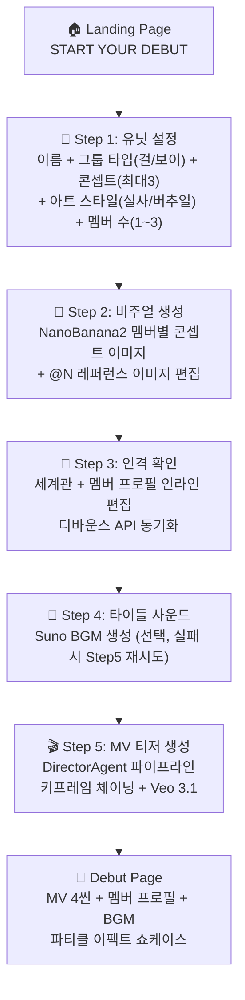

# Debut — 프로젝트 기획서

> **AI Virtual Idol Debut Simulator** — Gemini 3 Pro 멀티에이전트가 아이돌 그룹을 기획부터 MV 티저까지 3분 만에 프로듀싱

---

## 1. 프로젝트 개요

### 한 줄 요약
유닛 이름과 콘셉트만 입력하면, AI 에이전트가 멤버 기획 → 비주얼 생성 → MV 시나리오 → BGM → 32초 MV 티저까지 전 과정을 자동으로 프로듀싱하는 시스템.

### 해커톤
- **행사**: Gemini 3 서울 해커톤 2026
- **심사일**: 2026년 2월 28일 (토)
- **트랙**: 엔터테인먼트 분야의 Gemini

### 핵심 차별화

| 기존 AI 도구 | 한계 | Debut |
|-------------|------|----------|
| 단일 이미지 생성 (Midjourney, DALL-E) | 일회성, 맥락 없음 | 전체 그룹 세계관 기반 일관된 비주얼 |
| 비디오 생성 (Sora, Veo) | 프롬프트 수동 작성 | AI 에이전트가 시나리오 자동 설계 |
| 음악 생성 (Suno, Udio) | 독립적 생성 | MV 시나리오 무드에 맞춘 자동 연동 |
| K-pop 팬 콘텐츠 | 수동 편집 | 5단계 위저드로 완전 자동화 |

### 왜 "엔터테인먼트 분야의 Gemini"인가?
- K-pop 산업의 핵심 프로세스(기획 → 비주얼 → MV 제작)를 AI로 재현
- Gemini 3 Pro의 멀티모달 + 추론 능력으로 "크리에이티브 디렉터" 역할 수행
- NanoBanana2 (Gemini Image), Veo 3.1, Suno를 오케스트레이션하는 멀티에이전트

---

## 2. 사용자 플로우



---

## 3. 기술 스택

### 3.1 AI 서비스 (런타임)

| 서비스 | 용도 | 모델 |
|--------|------|------|
| **Gemini 3 Pro** | Director/Scenario/Concept 에이전트 LLM | `gemini-3-pro-preview` via AI Gateway |
| **Gemini 2.5 Flash** | Blueprint 생성 (빠른 텍스트) | `gemini-2.5-flash` via AI Gateway |
| **NanoBanana2** | 멤버 이미지 + 키프레임 이미지 생성 | `gemini-3-pro-image-preview` via AI Gateway |
| **Veo 3.1** | 8초 영상 클립 ×4 (first-last-frame-to-video) | `fal-ai/veo3.1/fast` via fal.ai |
| **Suno V4.5** | BGM 생성 (콜백+폴링 하이브리드) | `V4_5` via sunoapi.org |

### 3.2 인프라

| 기술 | 용도 |
|------|------|
| **Letsur AI Gateway** | OpenAI SDK 호환 게이트웨이 (`gateway.letsur.ai/v1`) |
| **fal.ai Queue API** | Veo 3.1 비동기 영상 생성 큐 |
| **sunoapi.org** | Suno API 래퍼 (콜백 웹훅 + 폴링 폴백) |

### 3.3 Backend

| 기술 | 용도 |
|------|------|
| **FastAPI** (Python) | REST API 서버 |
| **Pydantic v2** | 데이터 모델/밸리데이션 |
| **OpenAI Python SDK** | AI Gateway 호출 (AsyncOpenAI 싱글톤) |
| **httpx** | fal.ai, Suno 비동기 HTTP 클라이언트 |

### 3.4 Frontend

| 기술 | 용도 |
|------|------|
| **Next.js 16** | App Router + React 19 |
| **TypeScript 5.9** | 타입 안전 |
| **Tailwind CSS 4** | 다크 테마 UI |

---

## 4. 콘셉트 체계

### 걸그룹 (8종)

| 컨셉 | 대표 그룹 | 키워드 |
|------|-----------|--------|
| 걸크러쉬 | BLACKPINK, LE SSERAFIM | 강렬, 카리스마, 파워 |
| 청순 | Apink, 여자친구 | 순수, 깨끗, 첫사랑 |
| 큐트 | 초기 TWICE, ILLIT | 사랑스러움, 발랄, 핑크 |
| 틴크러쉬 | IVE, STAYC | 10대 자신감, 쿨, 트렌디 |
| 엘레강스 | Red Velvet, TWICE 후기 | 우아, 성숙, 세련 |
| 다크 | (G)I-DLE, Dreamcatcher | 미스터리, 고딕, 반항 |
| 레트로 | NewJeans, KISS OF LIFE | Y2K, 90s, 복고 |
| 퓨처리스틱 | aespa, MAVE: | 메타버스, AI, 사이버 |

### 보이그룹 (8종)

| 컨셉 | 대표 그룹 | 키워드 |
|------|-----------|--------|
| 파워풀 | Stray Kids, ATEEZ | 강렬, 퍼포먼스, 에너지 |
| 청량 | 세븐틴, RIIZE, TWS | 청춘, 밝음, 일상 |
| 다크판타지 | ENHYPEN, VIXX | 뱀파이어, 초자연, 미스터리 |
| 꽃미남 | TXT, ASTRO | 순수, 소년미, 로맨스 |
| 힙합/스트릿 | 초기 BTS, Block B | 자유, 반항, 래핑, 도시 |
| 몽환/드리미 | TXT, PLAVE | 판타지, 동화, 감성 |
| 레트로 | SHINee, SUPER JUNIOR | 복고, 디스코, 클래식 |
| 퓨처리스틱 | NCT, EXO | 우주, 테크, 메타버스 |

### 아트 스타일 (2종)
- **실사 (Realistic)**: 실제 K-pop 아이돌 스타일 포토리얼리스틱
- **버추얼 (Virtual)**: PLAVE, K/DA 스타일 애니메이션/일러스트

---

## 5. 킬러 데모 시나리오 (3분)

```mermaid
timeline
    title Debut 데모 플로우 (3분)
    0:00 - 0:15 : 랜딩 페이지
                 : Debut 로고 + START YOUR DEBUT
    0:15 - 0:40 : Step 1 유닛 설정
                 : "NOVA" 걸그룹, Dark + Elegant
                 : 실사 스타일, 2명 → 블루프린트 생성
    0:40 - 1:00 : Step 2 비주얼 생성
                 : 2명 콘셉트 이미지 동시 생성
                 : @N 레퍼런스로 이미지 편집 시연
    1:00 - 1:15 : Step 3 인격 확인
                 : 세계관 인라인 편집 시연
    1:15 - 1:30 : Step 4 타이틀 사운드
                 : K-pop dark pop BGM 프리뷰
    1:30 - 2:15 : Step 5 MV 티저 생성
                 : DirectorAgent 실시간 로그
                 : 키프레임 체이닝으로 이음새 없는 전환
    2:15 - 2:40 : MV 티저 완성
                 : 32초 4씬 시네마틱 영상 + BGM
    2:40 - 3:00 : Debut Page + 마무리
                 : 파티클 이펙트 쇼케이스
                 : "3분 만에 아이돌 그룹이 데뷔했습니다"
```

### 데모 핵심 포인트
- **"작동하는가?"** (심사 50%) → 블루프린트부터 MV까지 실제 생성되는 E2E 시연
- **멀티에이전트 오케스트레이션** → Concept, Scenario, Director Agent 역할 분담
- **키프레임 체이닝** → 씬 간 이음새 없는 전환 (first-last-frame-to-video)
- **병렬 처리** → 키프레임 5장 + BGM 동시, 영상 4개 동시 → 총 2~3분
- **인라인 편집** → 세계관, 멤버 프로필 실시간 수정 가능
- **걸/보이 + 실사/버추얼** → 다양한 조합 시연 가능

---

## 6. 타겟 유저

### 1차: K-pop 팬 / 크리에이터
- 나만의 가상 아이돌 그룹을 만들어보고 싶은 팬
- AI 콘텐츠 제작에 관심 있는 유튜버/틱톡커

### 2차: 엔터테인먼트 업계
- 신인 기획 시뮬레이션
- 콘셉트 테스트 (비주얼 + 세계관 프로토타이핑)
- MV 프리비즈 (Pre-visualization)

### 3차: AI 크리에이티브 도구
- Gemini 에이전트 오케스트레이션 레퍼런스 케이스
- 멀티모달 AI 파이프라인 데모

---

## 7. MV 티저 스펙

| 항목 | 스펙 |
|------|------|
| 총 길이 | 32초 (8초 × 4씬) |
| 화면비 | 9:16 (모바일 숏폼) |
| 해상도 | 720p |
| 씬 구조 | OPENING → BUILD → CLIMAX → REVEAL |
| 키프레임 | 5개 (4씬 이음새 없는 전환) |
| BGM | Suno V4.5 (콜백+폴링 하이브리드) |
| 캐릭터 | 멤버별 color_palette, motion_style 반영 |
| 카메라 | 씬별 고유 카메라 워크 (push-in, orbit, tracking) |
| 전환 | fade / dissolve / cut / zoom / wipe |

---

*Last Updated: 2026-02-28*
*Track: 엔터테인먼트 분야의 Gemini*
*Status: 구현 완료*
